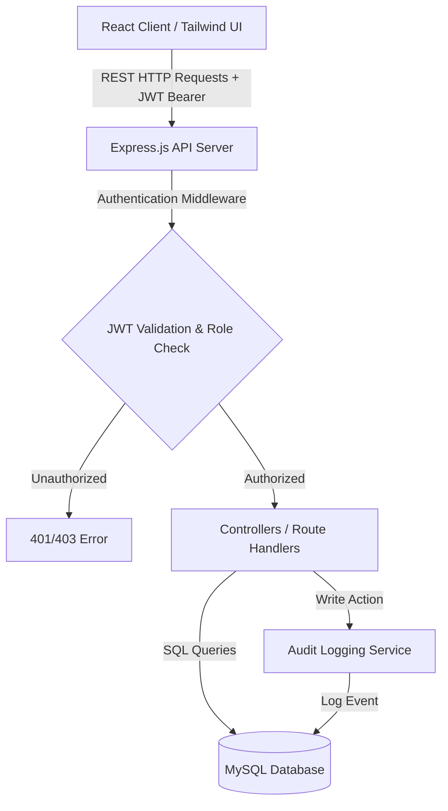

# Hospital Management Information System (MIS) - Comprehensive Project Documentation

## 1. Executive Summary
The **Hospital Management Information System (MIS)** is a production-grade, secure, and intuitive web application designed to digitize, unify, and streamline clinical and operational workflows in healthcare facilities. 

In modern healthcare administration, data fragmentation—ranging from siloed patient files to uncoordinated doctor schedules—leads to operational bottlenecks, billing errors, and compromised patient care. This system addresses these issues by acting as a single source of truth. It consolidates patient registration, appointment scheduling, electronic medical records (EMR), staff routing, billing, bed management, and audit logs into a unified, secure dashboard.

---

## 2. Why This Project? (Problem Statement & Solutions)
### The Problem:
* **Paper-Based Inefficiencies:** Many small-to-medium clinics and regional hospitals still rely on physical files. Retrieving clinical history during emergencies is slow and prone to human error.
* **Fragmented Software:** Systems that run scheduling separately from billing create data inconsistencies and delays.
* **Overwhelming Interfaces:** Enterprise software like Epic Systems or Cerner is highly complex, expensive, and requires intensive staff training.
* **Lack of Auditability:** Hard-copy records or basic spreadsheets don't log who accessed patient details, posing major security and privacy risks.

### Our Solution:
* **Centralized Data Hub:** One system connects administrative staff, medical staff, and administrators.
* **Simplified User Experience (UX):** A clean design built with soft colors (such as `#3D7068` and `#F6F5F2`) helps reduce stress and cognitive load for clinical staff.
* **Built-in Security & Audit Trails:** Every major database action is logged automatically, creating transparent audit logs.

---

## 3. System Architecture & How It Works
The application follows a standard **Client-Server-Database** architecture:



### The Request Lifecycle:
1. **User Authentication:** The client posts credentials to `/api/auth/login`. The server verifies the credentials using bcrypt, signs a JSON Web Token (JWT), and returns it to the client. The client stores this token in `localStorage`.
2. **API Request Routing:** For subsequent actions, the client attaches the JWT in the `Authorization` header as a Bearer token.
3. **Role Validation (RBAC):** Express middleware validates the token signature and verifies if the user's role (`admin`, `doctor`, `staff`) has access to the requested endpoint.
4. **Data Handling & Database Queries:** The controller queries the MySQL database pool, formats the response, and logs the action in the `audit_logs` table for compliance.
5. **State Rendering:** The React client updates its state and displays the relevant information in the UI.

---

## 4. Role-Based Module Breakdown (RBAC Matrix)

The application enforces a strict permission system at both the frontend (UI level) and backend (API level).

| Feature / Resource | Admin | Doctor | Staff | Description |
| :--- | :---: | :---: | :---: | :--- |
| **Dashboard Stats** | Full | Restricted | Operational | High-level metrics for Admins, patient queues for Doctors/Staff. |
| **Patient Directory** | CRUD | View Only | CRUD | Staff registers/updates profiles; Doctors view histories. |
| **Doctors Management** | CRUD | View Only | View Only | Only Admins can register or remove doctor accounts. |
| **Staff Management** | CRUD | None | None | Only Admins can manage administrative/operational staff. |
| **Medical Records** | Full | CRUD | Restricted | Diagnoses and prescriptions are restricted from operational staff. |
| **Appointments** | CRUD | View/Status | CRUD | Staff manages scheduling; Doctors view their queues. |
| **Audit Logs** | View Only | None | None | Immutable logs showing system activity, visible only to Admins. |

### Role Profiles:
* **Admin:** Manages user accounts (Doctors, Staff), views system audit trails, and reviews overall clinic statistics.
* **Doctor:** Manages clinical consultations. They can view assigned patients, edit electronic medical records, prescribe medications, and check their schedule.
* **Staff:** Handles operational tasks, including patient registration, booking appointments, bed allocation, and managing patient billing.

---

## 5. Detailed Tech Stack
* **Frontend:**
  * **React.js (v18+)** (Functional components, Hooks, and React Router for routing).
  * **Tailwind CSS** (Utility-first styling with custom hospital themes, soft canvas backgrounds, and alert badge styles).
  * **Vite** (Next-generation frontend tooling for fast builds).
* **Backend:**
  * **Node.js** (LTS Runtime).
  * **Express.js** (Routing, JSON parsing, CORS setup, and global error handling).
  * **JSON Web Tokens (JWT)** (Secure token-based authentication).
  * **Bcrypt.js** (Salted password hashing).
* **Database & Initialization:**
  * **MySQL (v8.0+)** (Relational database storing structured hospital data).
  * **mysql2/promise** (Promise-based client for Node.js).
  * **Self-Healing DB Initializer:** A custom script running on server startup that checks table schemas and automatically applies `schema.sql` and `seed.js` if the database is uninitialized.

---

## 6. Database Schema Details
The system is powered by a normalized MySQL schema consisting of 7 main tables:

```
  ┌──────────────┐          ┌──────────────┐
  │    users     │ 1 ─── 0..1│   doctors    │
  │ (Admin,Doc,  │          ├──────────────┤
  │    Staff)    │          │specialization│
  └──────┬───────┘          └──────┬───────┘
         │ 1                       │ 1
         │                         │
         │ 1                       │ 0..*
  ┌──────▼───────┐          ┌──────▼───────┐
  │    staff     │          │ appointments │
  └──────────────┘          ├──────────────┤
                            │ date / time  │
                            └──────▲───────┘
                                   │ 0..*
                                   │
  ┌──────────────┐ 1        1      │
  │   patients   ├─────────────────┘
  ├──────────────┤
  │ patient_code │ 1
  └──────┬───────┘
         │ 1
         │
         │ 0..*
  ┌──────▼───────┐          ┌──────────────┐
  │   medical_   │ 0..*    1│    audit     │
  │   records    ├──────────┤     logs     │
  └──────────────┘          └──────────────┘
```

1. **`users`:** Stores authentication credentials, hashed passwords, and system roles.
2. **`doctors`:** Stores professional info (specialization, department, availability) linked to a `user_id`.
3. **`staff`:** Stores operational staff details (department, contact) linked to a `user_id`.
4. **`patients`:** Stores patient profiles, ages, genders, addresses, admission status, and their assigned primary doctor.
5. **`appointments`:** Connects patients and doctors with scheduled dates, times, types (e.g., consultation), and statuses.
6. **`medical_records`:** Contains clinical diagnoses, prescriptions, and physician notes.
7. **`audit_logs`:** Tracks system actions (e.g., `CREATE_DOCTOR`, `UPDATE_PATIENT`) for security auditing.

---

## 7. Key Features & Uniqueness
1. **Automated Setup & Seeding:** The backend runs a database initializer on boot. If the database is blank (such as in a newly spun-up Railway container), it applies the schema and seeds it with realistic, localized data (Indian clinic names, departments, and doctor specialties), ensuring the application works immediately.
2. **Calming Design Language:** Hospital environments can be high-stress. We avoided harsh colors in favor of a soothing palette (Canvas: `#F6F5F2`, Primary Teal: `#3D7068`, Sidebar: `#1B2430`), reducing eye strain during long shifts.
3. **Client-Side/Server-Side Security Symmetry:** If a user tries to access a page they aren't authorized to view, React redirects them to a `403 Access Denied` page. If they attempt to bypass the frontend and query the API directly, the Express backend middleware rejects the request and logs the violation in the audit trail.

---

## 8. Future Roadmap
* **AI-Assisted Diagnostics:** Integrate machine learning models to analyze symptoms and suggest potential diagnoses for clinical review.
* **Patient Portal:** A portal for patients to download prescriptions, book appointments, and check billing history.
* **Telehealth Modules:** Integrated video consultations directly within the dashboard.
* **Inventory Management:** Pharmacy stock and medical supply tracking with automated reorder alerts.
